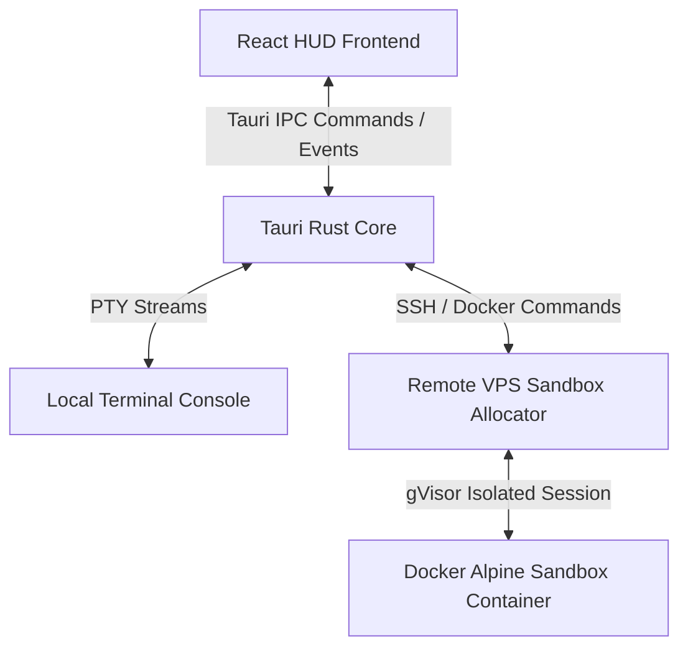

# Terminal Academy Desktop App (Tauri + React + Rust) 🚀

This is the official desktop client for Terminal Academy, offering a high-fidelity glassmorphic retro-digital HUD workspace interface. It links React-based frontend components directly to a native Rust backend that hosts local PTY interfaces and manages remote multi-tenant Docker sandboxes.

## 🛠️ Architecture & Core Mechanics



1. **Native PTY / SSH Allocator**: The Tauri application uses `portable-pty` to run SSH processes natively. When a desktop session launches, it automatically connects to Aeza VPS via SSH to scan active containers, allocate a container ID index `N`, and spawn a dedicated `academy-sandbox-N` session.
2. **Container Sandbox Recycler**: Commands like `reset-sandbox` or `reset` typed into the Work Terminal are intercepted client-side to stop and prune the active container remotely, instantly rebooting a fresh sandbox instance in under 2 seconds.
3. **AI Mentor Gate (Gemini API)**: The application monitors input and stdout telemetry to provide real-time Socratic feedback based on student execution outcomes.

---

## 🚀 Getting Started

### 📋 Prerequisites

To compile and run the desktop client, ensure you have installed:
* **Node.js** (v18.0+)
* **Rust & Cargo** (for Tauri native modules)
* **System Build Tools** (Xcode Command Line Tools on macOS, or build-essential on Linux)

### 🔑 Credentials Setup

1. **SSH Key Authentication**: The application connects to the remote server using an SSH private key located at `~/.ssh/id_ed25519`. Ensure this file exists and is authorized on the remote host (`89.22.239.107`).
2. **Gemini API Key**: If you have a private Gemini API Key, you can add it through the UI Settings menu. Alternatively, you can create a local configuration file:
   Create `terminal-academy-desktop/public/config.json`:
   ```json
   {
     "default_api_key": "YOUR_GEMINI_API_KEY_HERE"
   }
   ```
   *(Note: This file is ignored by Git to protect secrets.)*

---

## 💻 Development Commands

Install frontend dependencies:
```bash
npm install
```

Launch the Tauri app in development hot-reload mode:
```bash
npm run desktop
# or: npx tauri dev
```

Build the production-ready standalone installers:
```bash
npm run build
# or: npx tauri build
```

---

## 📂 Code Layout

* `/src`: React components, custom layouts, hooks, and CSS modules.
  * `App.tsx`: Main dashboard coordinator (handles multi-screen layouts, terminal events, AI prompts, and settings).
  * `App.css` & `index.css`: Matte mahogany, amber/glow layouts.
  * `public/`: Curriculums (`curriculum_*.md`), translation configs, and icons.
* `/src-tauri`: Native Rust backend.
  * `src/lib.rs`: Rust commands (`spawn_pty`, `write_pty`, `resize_pty`, `reset_sandbox`) and lifecycle handlers (window destruction hook to stop remote containers).
  * `tauri.conf.json`: Native system capabilities, window configurations, and build specs.

